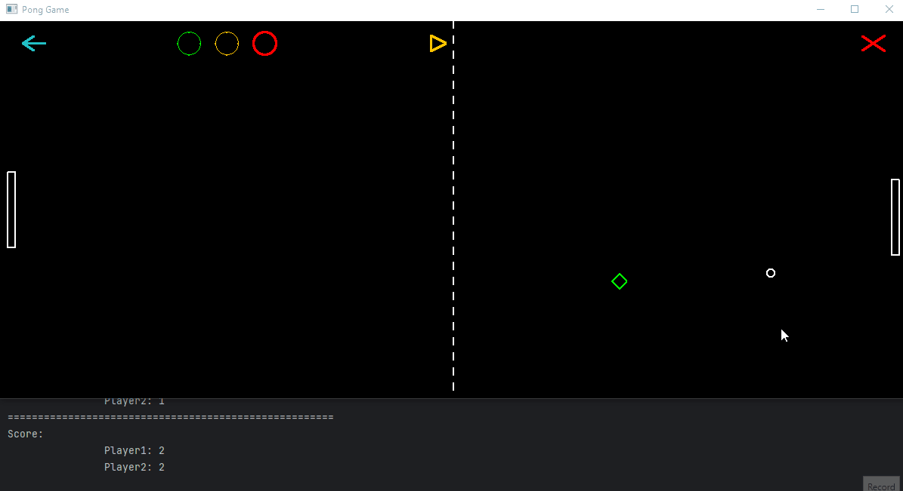

# Pong Game (OpenGL + Python)

A Two-player Pong game created as BRAC university CSE423:Computer Graphics group project using Python and PyOpenGL. Includes unique powerups, keyboard controls and difficulty settings.



---

## Team Members
- **Iftekhar Ahmed**
- Sakib Ul Haque
- Syed Mominul Quddus

---

## Controls

### Player 1
- `W` → Move Up  
- `S` → Move Down  

### Player 2
- `↑` → Move Up  
- `↓` → Move Down  

---

## Powerups & Effects

| Powerup Color  | Effect                                |
|----------------|----------------------------------------|
| Green + Red    | Board size increase/decrease          |
| White          | Board moves forward                   |
| Yellow         | Middle wall appears                   |
| Orange         | Ball speed changes                    |
| Purple         | Reverse board movement                |
| Blue           | Increase board movement speed         |

---

## Features

- Classic two-player Pong game
- Dynamic difficulty levels: Easy, Medium, Hard
- Powerups for enhanced gameplay
- Real-time keyboard controls
- Ball physics with edge & paddle bounce logic
- Pause, restart, and exit options

---

## Contributions

### ✦ Iftekhar Ahmed
- Game difficulty setting (easy, medium, hard)
- Ball bouncing at different angles off paddle
- Paddle movement with keyboard
- Powerups:
  - Middle wall
  - Ball speed change

### ✦ Sakib Ul Haque
- Ball movement & bounce logic
- Diamond (powerup) generation & animation
- Final score & Game Over screen
- Powerups:
  - Paddle size change
  - Paddle forward movement

### ✦ Syed Mominul Quddus
- Pause, restart, and exit controls
- Powerups:
  - Reverse paddle movement
  - Increase paddle movement speed

---

## How to Run

### Requirements:
- Python
- `pygame`
- `PyOpenGL`

### Install dependencies:
```bash
pip install pygame PyOpenGL
